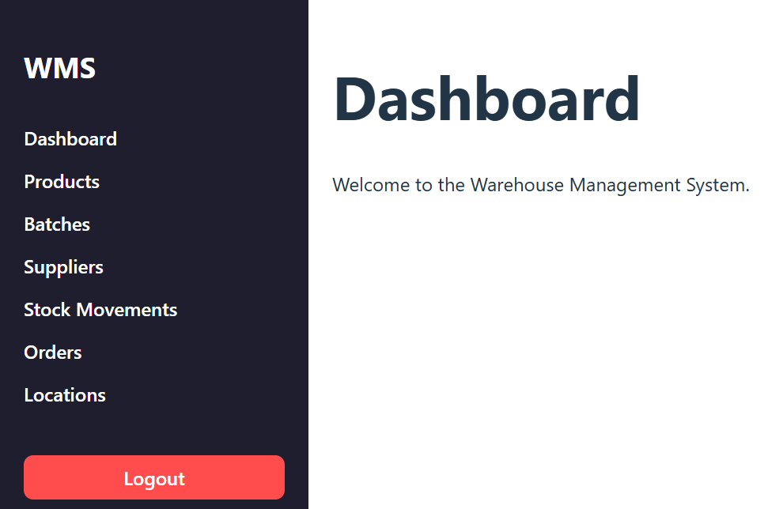
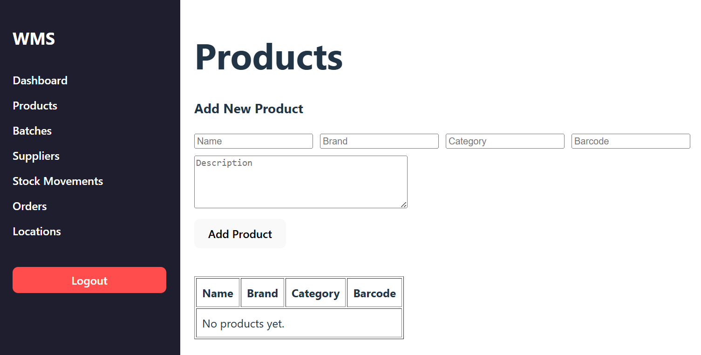
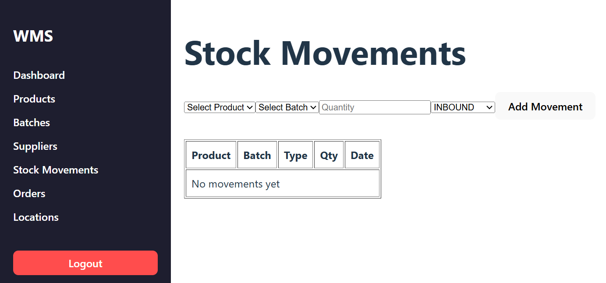
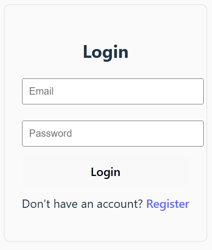

# Warehouse Management System Frontend

A frontend application for a warehouse management system built with React, React Router, and modern JavaScript tooling.

The application provides an interface for managing products, suppliers, orders, inventory batches, and stock movements through authenticated workflows connected to a backend API.

---

## Live Demo

Frontend Application: https://warehouse-management-frontend-eta.vercel.app

Frontend Repository: https://github.com/Agbak17/warehouse-management-frontend

Backend Repository: https://github.com/Agbak17/warehouse-management-backend

---

## Screenshots

### Dashboard



### Product Management



### Stock Movements Management



### Authentication



---

## Features

- JWT-based authentication
- Protected frontend routes
- Product and inventory management
- Batch-level stock tracking
- Supplier and order management
- REST API integration
- Responsive user interface
- Client-side routing with React Router

---

## Tech Stack

- React
- React Router
- JavaScript
- Axios
- CSS
- Vercel

---

## Architecture

- React frontend communicates with backend REST APIs
- JWT authentication used to secure protected pages
- React Router manages client-side navigation
- Axios handles API requests and authentication headers
- Frontend deployed on Vercel
- Backend API hosted separately on Render

---

## Local Development Setup

```bash
git clone https://github.com/Agbak17/warehouse-management-frontend.git
cd warehouse-management-frontend
npm install
```

---

## Environment Variables

Create a `.env` file in the root directory:

```env
VITE_API_URL=your_backend_api_url
```

---

## Run Locally

```bash
npm run dev
```

---

## Challenges & Lessons Learned

One of the main challenges during development was integrating frontend authentication with protected backend API routes using JWT tokens.

Additional challenges included:

- Managing authenticated client-side routing
- Handling API communication between Vercel and Render deployments
- Managing frontend state across inventory workflows
- Debugging production deployment and environment configuration issues
- Building responsive interfaces for warehouse operations

This project provided hands-on experience with frontend architecture, API integration, authentication workflows, deployment, and real-world debugging.

---

## Future Improvements

- Improved dashboard analytics
- Role-based frontend permissions
- Enhanced filtering and search functionality
- Real-time inventory updates
- Dark mode support
- Improved mobile responsiveness
- Automated frontend testing
